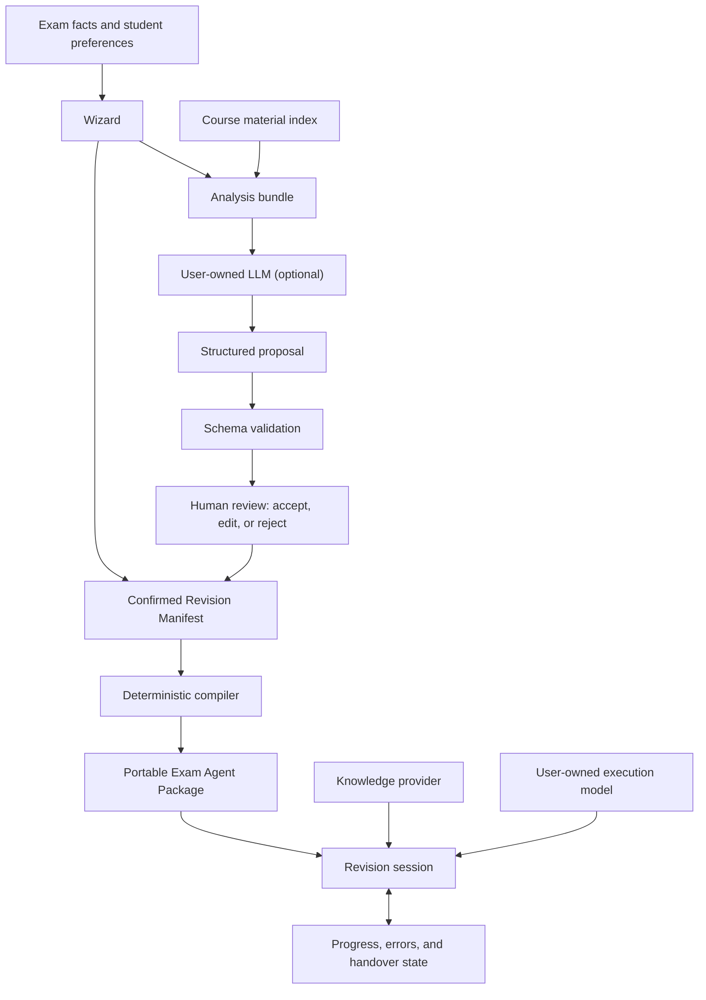

# Exam Protocol

> Build a course-grounded exam coach using your own AI model.

**Project status: concept / pre-alpha.** This repository currently preserves the product direction, design constraints, and implementation roadmap. The compiler and CLI described below are planned, not yet implemented.

Exam Protocol is a proposed compiler for turning confirmed exam facts, course-specific study rules, and model-generated suggestions into a portable revision agent package.

It is not another generic “chat with your PDFs” application. Its job is to preserve the parts of exam preparation that normally disappear when a student changes models or starts a new conversation:

- the actual exam scope and exclusions;
- the lecturer's terminology and marking style;
- topic priorities and question archetypes;
- the teaching, drilling, and grading workflow;
- known traps and recurring mistakes;
- the student's progress and next action.

The core idea is simple:

> **No inference is required to create a valid agent. Inference only improves the agent.**

A student should be able to build a useful revision protocol without paying for a high-reasoning model. If they choose to use one, it proposes improvements; it does not silently decide what is true.

## Why this exists

AI-assisted revision can work remarkably well after a student has carefully explained the course, exam, lecturer, materials, weaknesses, and desired learning method. The problem is that this setup is usually trapped inside one conversation.

Starting a new chat—or changing from Claude to ChatGPT, Gemini, Ollama, or another model—often means rebuilding that context from scratch. Important constraints get lost, inferred claims turn into “facts,” and progress becomes dependent on chat history.

Exam Protocol explores a different approach:

1. Keep exam facts, strategy, evidence, and learner state outside the model.
2. Ask models for structured proposals rather than final authority.
3. Require explicit human approval for inferred scope or strategy.
4. Compile the approved protocol deterministically into portable agent files.
5. Let the student choose the reasoning model and knowledge backend.

## Core user story

> As a student with fragmented course materials and exam intelligence, I want to use my own LLM to generate an evidence-backed revision protocol, so that any AI assistant can continue my exam preparation consistently without re-explaining the course, scope, terminology, or progress.

This breaks into three product capabilities:

| Capability | Student outcome |
|---|---|
| **Build** | Turn known exam facts and optional model suggestions into a reviewable protocol. |
| **Execute** | Make an AI teach, drill, and grade against course evidence and confirmed constraints. |
| **Continue** | Carry progress, mistakes, and the next session across models and conversations. |

## Product flow



The model is deliberately outside the source of truth. It can extract, classify, propose, explain, and grade, but the protocol controls what has been confirmed and how the workflow should run.

## Design principles

### 1. Deterministic first

Schema validation, template selection, state transitions, exclusions, required sections, and artifact generation should not require an LLM.

### 2. Bring your own model

Students choose the model used for analysis and execution. Exam Protocol should work with copy-paste workflows before it adds provider integrations.

### 3. Evidence before confidence

Every model suggestion should carry evidence and a confidence level. The system must distinguish:

- `confirmed`: explicitly provided by the student or directly supported by a source;
- `inferred`: a model proposal awaiting approval;
- `unknown`: unresolved, contradictory, or unsupported.

An inferred topic must never become confirmed merely because a model sounded certain.

### 4. Human approval is a product feature

The student can accept, edit, downgrade, or reject proposed priorities, question archetypes, traps, session groupings, and exit criteria.

### 5. State lives outside the conversation

Progress, recurring errors, readiness, and next steps belong in portable state files—not only in chat history.

### 6. Provider independence

The protocol should not depend on one LLM vendor, one embedding model, one IDE, or one RAG application.

### 7. Course materials are untrusted input

Retrieved text can provide evidence, but it cannot override the protocol or system instructions. Unsupported claims must remain visibly unsupported.

## Reference protocols

The idea grew from two detailed revision protocols that were effective in real study sessions:

- an **Operating Systems** protocol focused on calculations, reusable procedures, session exit criteria, source routing, and cross-chat handover;
- a **Requirements Engineering** protocol organized around question archetypes, source tags, terminology fidelity, a trap registry, strict grading, and artifact quality gates.

Although the subjects are different, they share a stable execution kernel:

| Shared layer | Purpose |
|---|---|
| Mission | Defines what “exam-ready” means for this course and student. |
| Grounding policy | Requires search or verification before teaching. |
| Terminology policy | Preserves lecturer-specific wording and labels. |
| Exam contract | Records format, time, marks, scope, and exclusions. |
| Source routing | Maps revision units to primary and supporting evidence. |
| Priority model | Allocates time by confidence and expected exam value. |
| Execution loop | Teaches, checks recall, drills, produces, and grades. |
| Assessment contract | Matches answer depth and structure to mark allocation. |
| Persistent state | Tracks readiness, mistakes, and handover context. |
| Quality gate | Prevents unsupported or structurally incomplete artifacts. |

The original protocols are intentionally **not published verbatim**. They contain course identifiers, lecturer-specific exam intelligence, source-file details, and material-derived wording that should not become public defaults. Sanitized examples and regression fixtures are planned once the schema is defined.

The first compiler milestone is not “generate a nice prompt.” It is:

> Reconstruct both reference protocols from one schema and a shared set of modules without hard-coding either course.

## Revision Manifest

Exam Protocol uses a thin **Revision Manifest**, not a heavyweight model of the entire course.

It stores only:

1. facts explicitly supplied or verified;
2. strategies approved by the student;
3. source routes needed for retrieval;
4. execution rules and learner state.

Illustrative shape—this is not yet a stable schema:

```yaml
schema_version: 1

course:
  name: Example Course
  answer_language: en
  coaching_language: zh-CN

student:
  starting_level: beginner
  available_sessions: 5
  learning_policy: teach_first

exam:
  duration_minutes: 120
  total_marks: 40
  answer_style: structured
  marking_policy: one_distinct_point_per_mark

grounding:
  search_before_answer: true
  exact_terminology: true
  unsupported_claim_behavior: mark_not_found
  require_citations: true

scope:
  confirmed: []
  excluded: []
  uncertain: []

revision_units:
  - id: example_unit
    type: concept
    priority: high
    sources:
      primary: []
      supporting: []
    exit_criteria:
      - explain_without_notes

runtime:
  loop: [teach, recall_check, drill, produce, grade]
  state_file: progress.yaml
```

It does not attempt to store a complete course knowledge graph, infer every prerequisite, or preserve the private internal representation of a particular embedding provider.

## BYOM: bring your own reasoning

Exam Protocol should support two modes through the same proposal schema and validator.

### Copy-paste mode — MVP priority

The CLI prepares an analysis bundle:

```text
analysis-bundle/
├── ANALYSIS_PROMPT.md
├── USER_CONTEXT.yaml
├── MATERIAL_INDEX.md
├── OUTPUT_SCHEMA.json
└── SUBMISSION_INSTRUCTIONS.md
```

The student submits the bundle to a model they already use, then imports the returned `revision-proposal.yaml`.

This mode avoids platform token costs, API-key storage, and provider lock-in. It also works with consumer chat subscriptions that do not expose an API.

### Provider-connected mode — later

The student configures an Anthropic, OpenAI-compatible, or local provider using environment variables. Prompts remain inspectable, keys are never committed, and the result follows the same validation and approval path as copy-paste mode.

The analysis prompt should use bounded tasks rather than an open-ended “make the best revision plan” request:

1. Extract explicit exam facts only.
2. Attach evidence to each fact.
3. Identify recurring question forms.
4. Propose revision units.
5. Propose priorities with reasons.
6. Report contradictions and unknowns.
7. Return schema-valid YAML or JSON.

## Compiler output

A compiled package may eventually contain:

```text
exam-agent-package/
├── CLAUDE.md
├── AGENTS.md
├── revision.yaml
├── source-routes.yaml
├── progress.yaml
├── error-log.yaml
├── skills/
│   ├── revision-coach/SKILL.md
│   ├── strict-grader/SKILL.md
│   └── mock-generator/SKILL.md
└── prompts/
    ├── teach.md
    ├── drill.md
    ├── grade.md
    ├── status.md
    └── handover.md
```

The exact export targets will evolve, but the confirmed manifest should remain the stable source from which they are generated.

## Product, Skill, MCP, and RAG

Exam Protocol is not a single Agent Skill.

| Component | Responsibility |
|---|---|
| **Compiler** | Converts an approved manifest into portable agent artifacts. |
| **Bootstrap Skill** | Helps a user's model create an evidence-backed proposal. |
| **Revision Coach Skill** | Executes a confirmed protocol during study sessions. |
| **LLM** | Provides optional analysis, tutoring, question generation, and grading. |
| **Knowledge provider** | Searches and returns cited course evidence. |
| **MCP** | May later expose retrieval and state operations to compatible hosts. |
| **State store** | Preserves progress and errors independently of chat history. |

Skills and agent files are compiler outputs. MCP and RAG are optional interfaces. The product is the protocol lifecycle: capture, propose, approve, compile, execute, and continue.

## Knowledge-provider boundary

Retrieval should answer a narrow question:

> Given a revision unit and an allowed source route, what evidence supports the current task?

It should not decide the exam scope or revision strategy.

Planned provider contract:

```typescript
interface KnowledgeProvider {
  search(query: string, sourceIds?: string[]): Promise<SearchResult[]>;
  getSource(sourceId: string): Promise<SourceDocument>;
}
```

Potential adapters:

- `LocalFilesProvider`
- `PortfolioRagProvider`
- `McpProvider`
- `GenericHttpProvider`

## Planned CLI experience

The commands below describe the intended workflow, not the current repository state:

```bash
exam-protocol init
exam-protocol export-analysis
exam-protocol import revision-proposal.yaml
exam-protocol review
exam-protocol validate
exam-protocol compile
```

An initial version should remain local-first and should not require a database, hosted service, or direct model integration.

## MVP scope

The smallest useful loop is:

```text
Wizard
→ Revision Manifest
→ Export analysis bundle
→ Import proposal
→ Validate and review
→ Compile agent files
→ Track progress, errors, and handover
```

### Included in the first implementation

- `revision.schema.json` and `proposal.schema.json`;
- a deterministic template compiler;
- an interactive CLI or wizard;
- copy-paste analysis export and proposal import;
- evidence/confidence validation;
- explicit human approval;
- at least one generic system-prompt export and one `CLAUDE.md` export;
- progress, error-log, and handover state;
- sanitized Operating Systems and Requirements Engineering fixtures;
- snapshot tests proving both fixtures use the same compiler.

### Explicit non-goals for the MVP

- automatically understanding any course and producing an “optimal” plan;
- a hosted SaaS, account system, billing, or collaboration features;
- platform-funded high-reasoning model calls;
- a complete Course IR, prerequisite graph, or knowledge graph;
- multi-agent orchestration;
- an MCP server;
- a complex web interface;
- tight coupling to Portfolio-RAG;
- publishing copyrighted slides, tutorials, or past papers.

## Roadmap

The roadmap is capability-based rather than date-based.

| Stage | Goal | Exit condition |
|---|---|---|
| **R0 · Specification** | Recover the common kernel from the two reference protocols. | One schema and module map can represent both without course-specific compiler branches. |
| **R1 · Compiler PoC** | Build schemas, validation, templates, and CLI compilation. | A valid protocol can be created without calling an LLM. |
| **R2 · BYOM workflow** | Export analysis bundles, import proposals, and review suggestions. | Inferred claims cannot enter the confirmed manifest without approval. |
| **R3 · Stateful revision** | Add progress, error logs, exit criteria, and handover. | A new model or conversation can continue the correct next session. |
| **R4 · Knowledge adapters** | Add local retrieval, then a provider-neutral remote adapter. | The same protocol works against more than one evidence backend. |
| **R5 · Interoperability** | Add more exports, provider-connected BYOM, and optional MCP. | The package runs across multiple compatible agent environments. |
| **R6 · Evaluation** | Test grounding, portability, and low-cost-model performance. | Results show where protocol constraints improve consistency and where they do not. |

## Planned repository layout

```text
Exam-Protocol/
├── schemas/
│   ├── revision.schema.json
│   └── proposal.schema.json
├── templates/
│   ├── base/
│   ├── exam-types/
│   ├── learning-modes/
│   ├── capabilities/
│   └── outputs/
├── prompts/
│   ├── analyse-course.md
│   ├── identify-archetypes.md
│   └── build-session-plan.md
├── examples/
│   ├── operating-systems/
│   └── requirements-engineering/
├── src/
│   ├── wizard/
│   ├── validator/
│   └── compiler/
└── README.md
```

No language or framework has been selected yet. The schema and fixtures should drive that decision, not the other way around.

## Relationship to Portfolio-RAG

[Portfolio-RAG](https://github.com/kong-pd/Portfolio-RAG) and Exam Protocol address different layers:

| Project | Layer | Responsibility |
|---|---|---|
| **Portfolio-RAG** | Evidence infrastructure | Document ingestion, retrieval, citations, user isolation, and streaming answers. |
| **Exam Protocol** | Agent policy | Exam facts, revision strategy, templates, approval, grading rules, and learner state. |
| **User-owned LLM** | Reasoning engine | Analysis proposals, teaching, question generation, and grading. |

They are sibling projects, not one codebase. Exam Protocol should work independently. After Portfolio-RAG reaches its own portfolio milestone, it may become an optional `KnowledgeProvider` through a stable HTTP or MCP adapter.

Exam-specific tables, agent generation, and learner progress do not belong inside Portfolio-RAG.

## Privacy, safety, and publishing rules

- Raw lecture slides, tutorials, marking schemes, and past papers should be private and gitignored by default.
- Public examples must use sanitized, synthetic, or redistributable material.
- Learner profiles and progress logs should remain local unless the student explicitly chooses otherwise.
- API keys must be read from environment variables and never stored in a manifest or repository.
- Retrieved course text must be treated as untrusted input.
- Claims without evidence must be marked as unknown instead of filled from model memory.
- Course-specific lecturer intelligence should not become a universal template default.

## Product hypotheses to validate

The central hypothesis is not simply that students want a smarter AI tutor.

> Will a student spend 10–20 minutes confirming exam facts and model suggestions in exchange for consistent, traceable, and portable revision sessions?

Early experiments should test whether:

- one schema can reconstruct both reference protocols without special cases;
- a no-LLM wizard can still produce a useful agent;
- the same package preserves scope and terminology across two different models;
- external progress state lets a new conversation resume correctly;
- every inferred priority can be traced to evidence;
- review takes minutes rather than becoming a new administrative burden;
- constrained low-cost models can handle most teaching and drilling tasks;
- students value cross-model portability over a single platform's persistent project.

## Immediate next steps

1. Produce sanitized structural outlines of the two reference protocols.
2. Mark each section as stable kernel, course variable, strategy proposal, or runtime state.
3. Draft the two schemas before choosing a language or building a UI.
4. Create fixtures and snapshot expectations for both reference cases.
5. Build the smallest compiler that emits one useful `CLAUDE.md` from a manually completed manifest.
6. Test the copy-paste BYOM flow with real students before adding provider integrations.

Until those steps validate the workflow, the project should resist MCP, multi-agent orchestration, a web dashboard, and other attractive distractions.

---

Exam Protocol is an early design exploration. The README is intentionally detailed so the original product reasoning survives long gaps between implementation phases.
